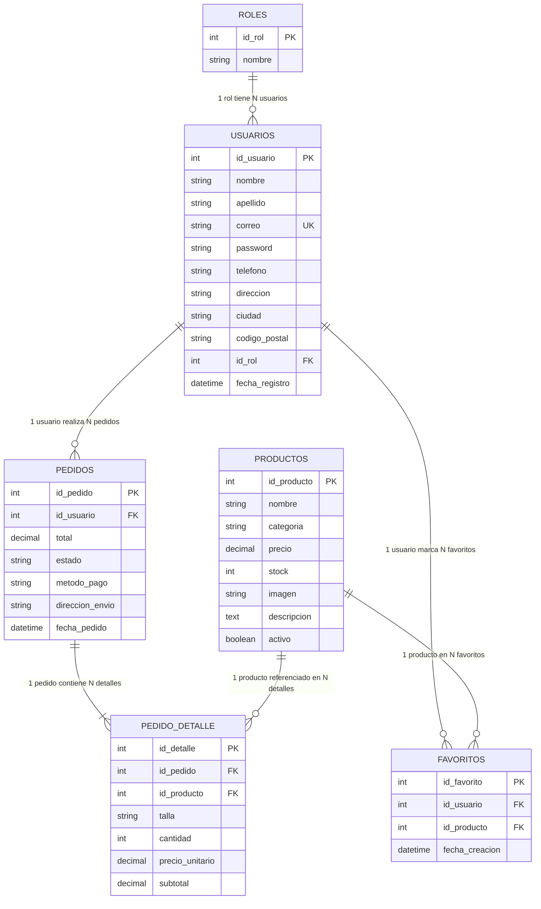

# 🗄️ Base de Datos, Migraciones y Modelos — Salinas Original

## 1. Información General
* **Motor:** MySQL / MariaDB (vía Laragon)
* **Base de datos:** `salinas_db`
* **Collation:** `utf8mb4_unicode_ci`
* **ORM:** Laravel Eloquent

---

## 2. Diagrama Entidad - Relación (Mermaid)

---

## 3. Diccionario de Datos

### 3.1. Tabla `roles`
| Campo | Tipo | Nulo | Clave | Descripción |
| :--- | :--- | :--- | :--- | :--- |
| `id_rol` | INT AUTO_INCREMENT | NO | PK | Identificador único del rol |
| `nombre` | VARCHAR(50) | NO | | Nombre del rol (`Cliente`, `Administrador`) |

### 3.2. Tabla `usuarios`
| Campo | Tipo | Nulo | Clave | Descripción |
| :--- | :--- | :--- | :--- | :--- |
| `id_usuario` | INT AUTO_INCREMENT | NO | PK | Identificador único de usuario |
| `nombre` | VARCHAR(80) | NO | | Nombre de pila |
| `apellido` | VARCHAR(80) | NO | | Apellido |
| `correo` | VARCHAR(120) | NO | UK | Correo electrónico institucional / personal |
| `password` | VARCHAR(255) | NO | | Contraseña encriptada con algoritmo Bcrypt |
| `telefono` | VARCHAR(20) | SÍ | | Número de contacto |
| `direccion` | VARCHAR(255) | SÍ | | Dirección de envío |
| `ciudad` | VARCHAR(80) | SÍ | | Ciudad de residencia |
| `codigo_postal` | VARCHAR(20) | SÍ | | Código postal de entrega |
| `id_rol` | INT | NO | FK | Rol asignado (1 = Cliente, 2 = Admin) |
| `fecha_registro` | DATETIME | NO | | Timestamp de creación de la cuenta |

### 3.3. Tabla `productos`
| Campo | Tipo | Nulo | Clave | Descripción |
| :--- | :--- | :--- | :--- | :--- |
| `id_producto` | INT AUTO_INCREMENT | NO | PK | Identificador de la prenda de vestir |
| `nombre` | VARCHAR(150) | NO | | Nombre comercial (ej: Camiseta Oversize) |
| `categoria` | VARCHAR(80) | NO | | Categoría (Buzos, Camisetas, Chaquetas, Pantalones) |
| `precio` | DECIMAL(10,2) | NO | | Precio de venta unitario en COP |
| `stock` | INT | NO | | Unidades disponibles en bodega |
| `imagen` | VARCHAR(255) | SÍ | | URL o ruta relativa de la foto del producto |
| `descripcion` | TEXT | SÍ | | Detalles de confección, corte y material |
| `activo` | TINYINT(1) | NO | | 1 = Visible en catálogo, 0 = Oculto |

### 3.4. Tabla `pedidos`
| Campo | Tipo | Nulo | Clave | Descripción |
| :--- | :--- | :--- | :--- | :--- |
| `id_pedido` | INT AUTO_INCREMENT | NO | PK | Número único de pedido |
| `id_usuario` | INT | NO | FK | Cliente que realizó la compra |
| `total` | DECIMAL(10,2) | NO | | Importe total liquidado |
| `estado` | VARCHAR(50) | NO | | Estado (`Pendiente`, `En Preparacion`, `Enviado`, `Entregado`) |
| `metodo_pago` | VARCHAR(50) | NO | | Medio de pago (`Nequi`, `Bancolombia`, `Tarjeta`) |
| `direccion_envio` | VARCHAR(255) | NO | | Dirección completa de destino |
| `fecha_pedido` | DATETIME | NO | | Fecha y hora en la que se generó la orden |

### 3.5. Tabla `pedido_detalle`
| Campo | Tipo | Nulo | Clave | Descripción |
| :--- | :--- | :--- | :--- | :--- |
| `id_detalle` | INT AUTO_INCREMENT | NO | PK | Identificador de la línea de detalle |
| `id_pedido` | INT | NO | FK | Referencia al pedido principal |
| `id_producto` | INT | NO | FK | Prenda comprada |
| `talla` | VARCHAR(10) | NO | | Talla seleccionada (XS, S, M, L, XL) |
| `cantidad` | INT | NO | | Número de prendas solicitadas |
| `precio_unitario`| DECIMAL(10,2) | NO | | Precio congelado al momento de compra |
| `subtotal` | DECIMAL(10,2) | NO | | `cantidad * precio_unitario` |

---

## 4. Migraciones y Seeders de Laravel
* **Migraciones (`database/migrations/`)**:
  - `2026_01_01_000001_create_roles_table.php`
  - `2026_01_01_000002_create_usuarios_table.php`
  - `2026_01_01_000003_create_productos_table.php`
  - `2026_01_01_000004_create_pedidos_table.php`
  - `2026_01_01_000005_create_pedido_detalle_table.php`
  - `2026_01_01_000006_create_favoritos_table.php`
* **Seeder principal (`database/seeders/DatabaseSeeder.php`)**:
  - Inserta los roles predeterminados.
  - Genera el usuario administrador por defecto (`admin@salinasoriginal.com`) y clientes de prueba.
  - Carga el catálogo inicial de prendas de vestir con stock, precios e imágenes.
